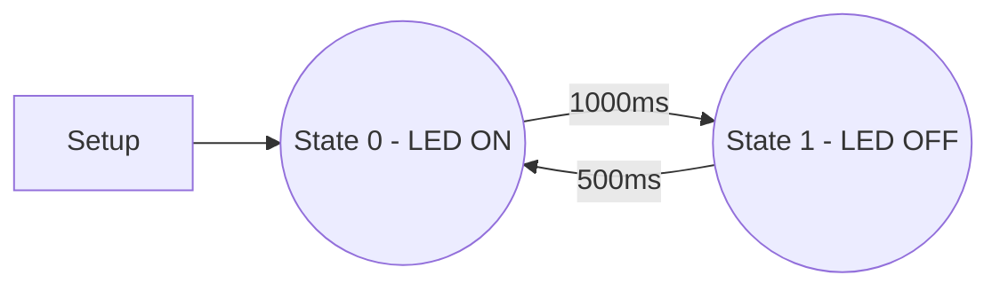

# StateMachine
This is a framework to develop with timed state machines in C that can be ported to 8/16/32 bits microcontrollers with a lightweight footprint.
*The compiles should support function pointers.

The big idea is to work on developing state-by-state in different unique functions and linking the states with a scheduler.
I used this framework to work around the missing implementation of FreeRtos in some old microcontrollers of the dsPIC family. As I like the implementation I decide to port to Arduino and share it with all.

      void state1()
      {
         ...
         doSomething()
         ...
         setNextState(state2, ...);
      }
      
      void state2()
      {
         ...
         doSomethingDifferent()
         ...
         setNextState(state1, ...);
      }

# How to use
This framework was developed to work with microchip microcontrollers and was ported to the Arduino platform. This repository has the Arduino version of examples, but with a bit of work, it can be ported to any microcontroller.

## Using the framework

### On the main file:

1. Include the .h docs
   
        #include <StateMachine.h>
        #include <StateMachine_Port.h>
   
2. Create an Enumerator with all machine states that will be used in the project.

        /* State Machine */
        enum
        {
          /* Add here all state machine of project */
            MAINAPP_MACHINE = 0,
            BLINK_MACHINE,
        
          /* Last Item */
            STATEMACHINE_OBJECTS_QTY	// must not remove!!!
        };
   
3. Create the following global variables

        xStateMachineEventFlags eventsControl;
        xStateMachine xStateMachinery[STATEMACHINE_OBJECTS_QTY];

4. Initialize the variable on the setup() function (or main() if you are porting)

        vSM_Init(xStateMachinery, STATEMACHINE_OBJECTS_QTY);	// Initialize the StateMachine Core
        eventsControl = vSM_initEventFlags();					        // Initialize the events controller for communication between different machine states

5. Call the setup function of the machine state passing the machine ID (enumerator of step 2) and the flag events control (explained below)

        mainApp_setup(MAINAPP_MACHINE, &eventsControl);       // Initializes the main app
        blink_setup(BLINK_MACHINE, &eventsControl);           // Initializes the blink

6. Call the "scheduler" on loop() (or infity loop if you are porting)

        void loop() {
          vSM_RunAtInfinitLoop();         // State machine run
        }
or

      void main() {
      
      ....
      
        while(1){
          vSM_RunAtInfinitLoop();         // State machine run
        }
      
      }
      
### On the "Task" file:

Example:

1. On `.c` file create two global variables
        
        uint16_t blink_MShandle;
        xStateMachineEventFlags *blink_MSeventflags;					// not required

A `uint16_t` holds the Id of the machine state, and a `pointer` to an event flag, that can be used for intercomunication of machine states.

2. Create a setup function that should receive a `uint16_t` with the Id of the machine state and the pointer to events flags.

        void blink_setup(uint16_t machineStateHandle, xStateMachineEventFlags *flags)
        {
          blink_MShandle = machineStateHandle;						// internal handler receive the machine state addr
          blink_MSeventflags = flags;
          ...
        }
3. Set the next state, that will run after the `vSM_RunAtInfinitLoop()` starts the scheduler.

        void blink_setup(uint16_t machineStateHandle, xStateMachineEventFlags *flags)
        {
        	blink_MShandle = machineStateHandle;						// internal handler receive the machine state addr
          blink_MSeventflags = flags;
        
        	/* Setup */
        	Serial.println("blink setup");
          pinMode(2, OUTPUT);
        
        	/* Set next state */
        	vSM_setNextStateIdx(blink_MShandle, blink_st0, 1);
        
        }

The `vSM_setNextStateIdx();` receive as parameter: The Id of state, the function pointer to the next state, and the time to wait to execute the next state

4. Implement the next states

        void blink_st0()
        {
          Serial.println("In blink st0 function");
          digitalWrite(2, true);
         
          vSM_setNextStateIdx(blink_MShandle, blink_st1, 1000);
        }
        
        void blink_st1()
        {
          Serial.println("In blink st1 function");
          digitalWrite(2, false);
         
        	vSM_setNextStateIdx(blink_MShandle, blink_st0, 500);
        }

# Porting

To create a porting of the machine state, edit the StateMachine_Port files `.c` and `.h`

1. Edit the `vStateMachine_TickConfigure()` function to configure a hardware timer of 1ms and call the `vSM_Tick();` every 1ms.
2. Define some functions to overload in the framework

        #define StateMachine_DisableTick noInterrupts();          // disable all interrupts
        #define StateMachine_EnableTick  interrupts();             // enable all interrupts//
        #define StateMachine_NOP         Serial.println("NOP")     //
        #define StateMachine_LOG(log)    Serial.println(log)

The implementation is based on articles by Pedro Bertoleti and Rodrigo Almeida on www.embarcados.com.br. Thank you for sharing your knowledge.
https://github.com/phfbertoleti
https://github.com/rmaalmeida

https://embarcados.com.br/desenvolvendo-um-rtos-introducao/
https://embarcados.com.br/maquina-de-estado/
https://embarcados.com.br/arquitetura-de-desenvolvimento-de-software-i/
